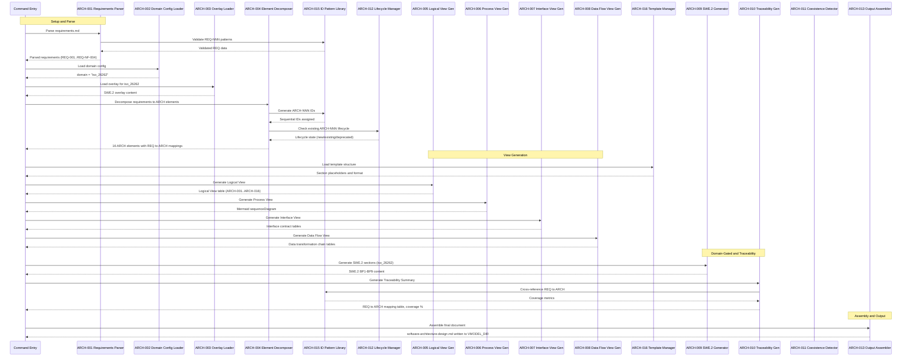
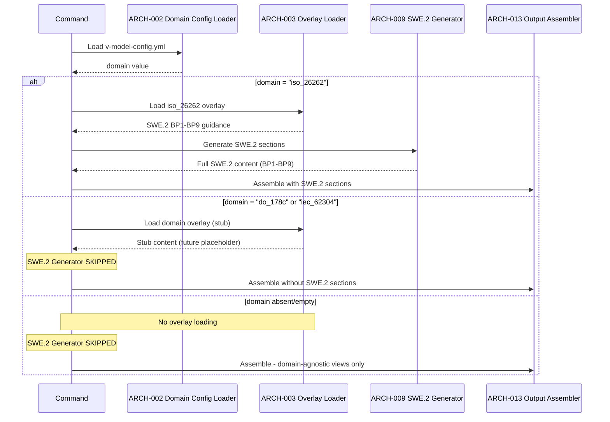

# Software Architecture Design: Software Architecture Design (Path B)

**Feature Branch**: `007-software-architecture-design`
**Created**: 2026-05-04
**Status**: Draft
**Source Requirements**: `specs/007-software-architecture-design/v-model/requirements.md`

## Overview

This software architecture design decomposes the 24 functional requirements and 4 non-functional requirements (REQ-001 through REQ-NF-004) into 16 architecture elements (ARCH-001 through ARCH-016). The decomposition organizes elements across four views: Logical (component breakdown with purpose, function, and dependency attributes), Process (runtime interaction sequences), Interface (entity-to-entity contracts with external/internal distinction), and Data Flow (data transformation chains with data design).

The architecture follows a pipeline pattern: requirements are parsed → domain configuration is loaded → requirements are decomposed into architecture elements → four architecture views are generated → SWE.2 sections are generated (when `domain: iso_26262`) → output is assembled and written. A coexistence detector checks for Path A artifacts and emits warnings without blocking generation.

This is a **Path B (combined)** artifact — ARCH elements trace strictly to `REQ-NNN` identifiers with no `SYS-NNN` references. The four architecture views are domain-agnostic and always generated. ASPICE SWE.2 BP1–BP9 sections are included because the domain is configured as `iso_26262` in `v-model-config.yml`.

## Architecture Framing

### Architecture Intent

This architecture pass defines the software architecture design command generator — an AI-driven pipeline that reads `requirements.md`, loads domain configuration, decomposes requirements into IEEE 1016 design entities within IEEE 42010 architecture views, optionally generates ASPICE SWE.2 BP1–BP9 content, performs ISO/IEC 42030 evaluation, and assembles the output artifact. The architecture must preserve strict REQ→ARCH traceability, domain-gated SWE.2 generation, deterministic output structure per the template, and lifecycle integrity across regenerations.

### Core Tensions and Tradeoffs

| Tension | Current Tradeoff Direction | Affected Views | Consequence |
|---------|----------------------------|----------------|-------------|
| Completeness vs Strict Translation | Every REQ must map to an ARCH, but the translator constraint prohibits inventing capabilities. Resolved by [CROSS-CUTTING] tagging and [DERIVED] flagging. | Logical | Derived items are flagged for human review rather than silently incorporated. |
| Modularity vs Performance | 16 ARCH elements in a sequential pipeline for modularity and independent testability, accepting single-threaded execution overhead. | Process, Data Flow | Sequential dependency accepted for deterministic debugging; no parallelism needed. |
| Domain Extensibility vs Simplicity | Overlay mechanism (ARCH-003) adds file I/O but enables zero-modification domain extension. | Logical, Interface | New domains added via overlay files without modifying pipeline core. |

### Stable Boundaries

| Boundary | Must Remain Stable Because | Forbidden Crossing | Affected Views |
|----------|----------------------------|--------------------|----------------|
| Pipeline sequence | Each stage's output is the next stage's input — breaking the chain breaks architecture coherence. | No element may skip a stage or write directly to the output file (only ARCH-013 writes). | Logical, Data Flow |
| REQ→ARCH traceability | Path B independence from system-design requires strict REQ→ARCH mapping. | No ARCH element may reference SYS-NNN parents. | Logical |
| Domain gate | SWE.2 must only appear for iso_26262 per the feature specification. | SWE.2 content must not leak into non-iso_26262 outputs. | Logical, Interface |
| ID permanence | ARCH IDs are permanent; renumbering breaks downstream traceability. | No renumbering of existing ARCH-NNN identifiers. | All |

### Change Axes

| Expected Change | Isolated By | Affected Views | Architecture Consequence |
|-----------------|-------------|----------------|--------------------------|
| New domain standards | ARCH-003 (Overlay Loader) | Logical, Interface | New overlays added under `commands/overlays/` without modifying pipeline core. |
| New IEEE 42010 view types | ARCH-005..ARCH-008 (View Generators) | Logical, Process, Interface, Data Flow | New view generator added to pipeline; assembler (ARCH-013) extended. |
| ASPICE process revision | ARCH-009 (SWE.2 Generator) | Logical | BP updates contained in overlay file; generator logic unchanged. |
| New requirement categories | ARCH-004 (Decomposer) + ARCH-015 (ID Pattern Library) | Logical | ID regex patterns updated; decomposition logic extended. |

### Invariants

| Invariant | Evidence Source | Risk If Violated |
|-----------|----------------|------------------|
| Every REQ-NNN appears as a parent in >=1 ARCH-NNN | REQ-003, REQ-016 | Coverage gap breaks traceability matrix; SC-003 unsatisfied. |
| ARCH elements never reference SYS-NNN parents | REQ-007 | Path B independence violated; mixed traceability confuses downstream tools. |
| SWE.2 sections only when domain == "iso_26262" | REQ-008, REQ-010 | Non-automotive compliance violation; audit failure. |
| No invented architecture elements beyond requirements | REQ-013 | AI hallucination; untestable architecture elements. |
| ARCH IDs permanent, never renumbered | REQ-002, REQ-019 | Traceability links broken; downstream artifacts become suspect. |

### Non-goals / Anti-patterns

| Non-goal / Anti-pattern | Why It Is Out of Scope or Harmful | Affected Views |
|-------------------------|-----------------------------------|----------------|
| Implementation details in architecture views | Architecture must stay at design-entity level per IEEE 1016. | All |
| Black-box ARCH elements without interface contracts | Prevents Interface Fault Injection testing at integration level. | Interface |
| Parallel pipeline execution | Not needed for single-artifact generation; adds complexity without benefit. | Process |
| Persistent intermediate storage | CLI re-runs are cheap; no sensitive intermediate data to preserve. | Data Flow |

### Responsibility Collision Risks

| Risk | Why It Is Likely to Be Merged | Separation Strategy |
|------|-------------------------------|---------------------|
| Parsing logic merged with decomposition logic | Both operate on requirements data | Separated by ARCH-001 to ARCH-004 explicit interface contract |
| View generation merged with output assembly | Both produce Markdown output | Separated by ARCH-005..ARCH-008 to ARCH-013 pipeline stage |
| Lifecycle management merged with ID assignment | Both operate on ARCH identifiers | Separated by ARCH-012 (lifecycle) and ARCH-015 (ID patterns) |
| Domain loading merged with SWE.2 generation | Both are domain-gated | Separated by ARCH-003 (loading only) and ARCH-009 (generation only) |

### Implementation Details to Exclude

| Category | Excluded Items | Belongs In |
|----------|---------------|------------|
| Programming constructs | Concrete classes, function signatures, DTO field names | Module Design |
| Infrastructure | Framework selections, database schemas, deployment manifests | Module Design / Implementation |
| APIs | REST endpoint paths, GraphQL mutation names, gRPC proto fields | Module Design |
| Script internals | Shell script file paths, CLI flag names, exit code values | Module Design |

## ID Schema

- **Architecture Element**: `ARCH-NNN` — sequential identifier for each architecture element (3-digit, zero-padded)
- **Parent Requirements**: Comma-separated `REQ-NNN` list per element (many-to-many)
- **Cross-Cutting Tag**: `[CROSS-CUTTING]` for infrastructure/utility elements that serve the system as a whole
- Example: `ARCH-001` with Parent Requirements `REQ-001, REQ-020` — Requirements Parser serves both input validation and graceful error handling.

## Architecture Design

### Logical View

| ARCH ID | Name | Description (Purpose) | Parent Requirements (Dependencies) | Type |
|---------|------|----------------------|-----------------------------------|------|
| ARCH-001 | Requirements Parser | Reads and parses requirements.md to extract all REQ-NNN identifiers, descriptions, priorities, rationales, and verification methods. Produces a structured representation of functional and non-functional requirements. Validates that the input file is non-empty and contains at least one REQ-NNN. Fails gracefully with a clear error message when requirements.md is missing, empty, or contains zero REQ identifiers. Supports 50+ REQ identifiers without truncation. | REQ-001, REQ-020 | Component |
| ARCH-002 | Domain Config Loader | Reads v-model-config.yml from the repository root and extracts the domain field. Returns the domain value (iso_26262, do_178c, iec_62304, or null when absent/empty). Serves as the single source of truth for domain-gated behavior across all downstream generators. | REQ-008, REQ-009, REQ-010 | Component |
| ARCH-003 | Overlay Loader | Discovers and loads domain overlay files from commands/overlays/{domain}/software-architecture-design.md based on the domain value from ARCH-002. When domain: iso_26262, loads SWE.2 BP1-BP9 guidance content. When domain is do_178c or iec_62304, loads stub content (future extensibility hook). Returns null when no domain is configured or overlay file does not exist. | REQ-008, REQ-009 | Component |
| ARCH-004 | Architecture Element Decomposer | Receives parsed requirements and decomposes them into ARCH-NNN elements following the strict translator constraint. Assigns IEEE 1016 design entity attributes: identifier, purpose, function, subordinates (none), and dependencies (parent REQ-NNN). Enforces many-to-many REQ-ARCH relationships. Identifies [CROSS-CUTTING] elements for infrastructure concerns. Flags [DERIVED MODULE] and [DERIVED REQUIREMENT] when capabilities are architecturally necessary but lack REQ parents. Prohibits SYS-NNN references. Supports 50+ REQ inputs. | REQ-002, REQ-007, REQ-013, REQ-014, REQ-015, REQ-021, REQ-022 | Component |
| ARCH-005 | Logical View Generator | Generates the Logical View table from decomposed ARCH elements. Populates columns: ARCH ID, Name, Description, Parent Requirements, Type. Ensures every REQ-NNN appears in at least one row. Distinguishes business-logic elements from cross-cutting elements with the [CROSS-CUTTING] tag. Renders the IEEE 1016 decomposition and dependency relationships in IEEE 42010 Logical View format. | REQ-003, REQ-023 | Component |
| ARCH-006 | Process View Generator | Generates Process View content from ARCH element definitions and interaction paths. Produces Mermaid sequenceDiagram blocks for critical interaction paths. Documents concurrency model (single-threaded pipeline), synchronization points, decision branches, and execution order constraints. Includes domain branching logic (SWE.2 generation gated by domain). | REQ-004 | Component |
| ARCH-007 | Interface View Generator | Generates Interface View contract tables for every ARCH-NNN element. Produces external interface contracts (CLI entry points, file I/O) and internal interface contracts (element-to-element). Documents direction, protocol, input/output format, and error handling strategy. Enforces the "no black box" rule. | REQ-005 | Component |
| ARCH-008 | Data Flow View Generator | Generates Data Flow View transformation chains showing how data moves through architecture elements. Documents pipeline stages, input/output formats, transformations, and intermediate data formats. Generates the Data Design supplement (data entities, owning ARCH, storage, protection, lifecycle). | REQ-006 | Component |
| ARCH-009 | SWE.2 Section Generator | Generates ASPICE SWE.2 BP1-BP9 content when domain is iso_26262. Consumes overlay content from ARCH-003. Produces nine BP sections: architectural design description, requirement allocation table, interface summary, dynamic behavior description, resource objectives, alternatives evaluation, bidirectional traceability, consistency assurance, and communication summary. Skips entirely when domain is not iso_26262 or overlay is null. Targets >=90% SWE.2 compliance score per SC-004. | REQ-008, REQ-011 | Component |
| ARCH-010 | Traceability Generator | Computes forward and backward coverage metrics from the REQ-ARCH mapping. Generates the Traceability Summary section with total requirements, total architecture elements, coverage percentage, and the REQ to ARCH mapping table. Cross-references every REQ-NNN against all ARCH-NNN parent columns to ensure 100% forward coverage. | REQ-016 | Component |
| ARCH-011 | Coexistence Detector | Checks whether architecture-design.md (Path A artifact) exists in the v-model directory. When found, emits a warning message and proceeds without error. Path A artifacts are never overwritten or modified. Records the coexistence status for the output assembler. | REQ-012 | Utility |
| ARCH-012 | Lifecycle Manager | Manages existing ARCH-NNN identifiers across regenerations. Enforces lifecycle rules: never renumber existing IDs, mark replaced modules as [DEPRECATED], mark removed modules as [DEPRECATED - Withdrawn]. Preserves deprecated modules in output. Detects suspect modules when parent REQ is deprecated or modified. | REQ-019 | Service |
| ARCH-013 | Output Assembler | Assembles all generated sections into the final software-architecture-design.md document using the template structure. Applies header metadata (feature, branch, date). Merges sections in the correct order: Overview, Logical View, Process View, Interface View, Data Flow View, Architecture Evaluation, SWE.2 sections, Traceability Summary. Writes to VMODEL_DIR/software-architecture-design.md via atomic write. | REQ-001 | Component |
| ARCH-014 | Setup Script Adapter | Adapts setup-v-model.sh and setup-v-model.ps1 to support the --require-reqs flag. Returns JSON with VMODEL_DIR, FEATURE_DIR, BRANCH, REQUIREMENTS, and AVAILABLE_DOCS. Includes software-architecture-design.md in AVAILABLE_DOCS for downstream command discovery. Validates that requirements.md exists when --require-reqs is set. | REQ-017, REQ-018 | Adapter |
| ARCH-015 | ID Pattern Library | Provides deterministic regex-based patterns for extracting and validating REQ-NNN, ARCH-NNN, SYS-NNN, and other identifiers. Shared across parsing (ARCH-001), decomposition (ARCH-004), and traceability (ARCH-010) stages. Ensures consistent identifier recognition across the entire pipeline. | REQ-002 | Library |
| ARCH-016 | Template Manager | Reads templates/software-architecture-design-template.md and provides section placeholders and output structure to all generators. Ensures consistent output structure across all AI-generated artifacts. Template enforcement prevents structural drift across regenerations. | REQ-024 | Library |

#### Logical View Gaps

| Gap | Affected Element / Capability | Why It Matters |
|-----|------------------------------|----------------|
| None | All 28 requirements (REQ-001..REQ-024, REQ-NF-001..REQ-NF-004) are mapped to at least one ARCH element. All 16 ARCH elements have explicit parent REQ identifiers. No logical gaps. | Not applicable |

### Process View

**Concurrency Model**: Single-threaded sequential pipeline. Each stage completes before the next begins. No parallelism — deterministic execution for reproducible output.

**Synchronization Points**: Domain branching decision (ARCH-002 to ARCH-003) gates whether SWE.2 generation executes. Coexistence check (ARCH-011) gates warning emission. All synchronization is sequential — no mutex, semaphore, or barrier needed.

### Interaction: Full Pipeline Execution

### Interaction: Domain Branching (iso_26262 vs Non-Regulated)

#### Process View Gaps

| Gap | Affected Runtime Link / Scenario | Why It Matters |
|-----|----------------------------------|----------------|
| None | All critical interaction paths are documented: full pipeline execution and domain branching. Concurrency model (single-threaded sequential) is explicitly stated. Synchronization points (domain gate, coexistence check) are identified. No process gaps. | Not applicable |

## Interface View — External Interface Contracts

#### ARCH-001: Requirements Parser

| Direction | Name | Type | Format | Constraints |
|-----------|------|------|--------|-------------|
| Input | feature_dir | String | Path to feature directory | Required |
| Output | parsed_requirements | Array | [{id: REQ-NNN, description, priority, rationale, verification}] | Must be non-empty; at least one REQ-NNN required |
| Exception | EMPTY_INPUT | Error | Plain text | "requirements.md is empty or contains zero REQ-NNN identifiers" |

#### ARCH-002: Domain Config Loader

| Direction | Name | Type | Format | Constraints |
|-----------|------|------|--------|-------------|
| Input | config_path | String | Path to v-model-config.yml | Optional; file may not exist |
| Output | domain_value | String or null | Domain string or null | Valid values: iso_26262, do_178c, iec_62304, or null |
| Exception | PARSE_ERROR | Error | Plain text | "Failed to parse v-model-config.yml" |

#### ARCH-003: Overlay Loader

| Direction | Name | Type | Format | Constraints |
|-----------|------|------|--------|-------------|
| Input | domain_value | String or null | Domain string from ARCH-002 | null = skip loading |
| Output | overlay_content | String or null | Markdown content or null | null when overlay file not found or domain is null |
| Exception | FILE_NOT_FOUND | Warning | Plain text | "Overlay file not found for domain" - non-fatal |

#### ARCH-004: Architecture Element Decomposer

| Direction | Name | Type | Format | Constraints |
|-----------|------|------|--------|-------------|
| Input | parsed_requirements | Array | Structured REQ objects from ARCH-001 | Must be non-empty |
| Output | arch_elements | Array | [{id: ARCH-NNN, name, description, parentReqs, type, tags, lifecycleState}] | Must be non-empty; every REQ-NNN mapped to >=1 ARCH-NNN |
| Exception | NO_REQS_FOUND | Error | Plain text | "No REQ-NNN identifiers found in requirements" |

#### ARCH-005: Logical View Generator

| Direction | Name | Type | Format | Constraints |
|-----------|------|------|--------|-------------|
| Input | arch_elements | Array | ARCH element definitions from ARCH-004 | Required |
| Output | logical_view | String | Markdown table | Must be non-empty; every REQ-NNN appears in >=1 row |
| Exception | EMPTY_VIEW | Error | Plain text | "Logical View generation failed: no ARCH elements provided" |

#### ARCH-006: Process View Generator

| Direction | Name | Type | Format | Constraints |
|-----------|------|------|--------|-------------|
| Input | interaction_specs | Object | {arch_definitions, interaction_paths} | Required |
| Output | process_view | String | Mermaid diagram blocks + concurrency model description | Must contain >=1 valid sequenceDiagram |
| Exception | INVALID_MERMAID | Error | Plain text | "Process View generation failed: invalid Mermaid syntax" |

#### ARCH-007: Interface View Generator

| Direction | Name | Type | Format | Constraints |
|-----------|------|------|--------|-------------|
| Input | arch_elements | Array | ARCH element definitions | Required |
| Output | interface_view | String | Contract tables (External + Internal) | Every ARCH element must have contract entries; no black boxes |
| Exception | BLACK_BOX_WARNING | Warning | Plain text | "ARCH-NNN has no interface contract - refinement required" |

#### ARCH-008: Data Flow View Generator

| Direction | Name | Type | Format | Constraints |
|-----------|------|------|--------|-------------|
| Input | data_flow_specs | Object | {arch_definitions, data_flow_paths} | Required |
| Output | data_flow_view | String | Transformation chain tables + data design supplement | Must cover all pipeline stages |
| Exception | BROKEN_CHAIN | Error | Plain text | "Data Flow View generation failed: broken transformation chain" |

#### ARCH-009: SWE.2 Section Generator

| Direction | Name | Type | Format | Constraints |
|-----------|------|------|--------|-------------|
| Input | overlay_content | String or null | Markdown content from ARCH-003 | null = skip generation |
| Input | arch_elements | Array | ARCH element definitions | Required when overlay is non-null |
| Output | swe2_sections | String or null | SWE.2 BP1-BP9 Markdown sections | null when domain is not iso_26262 |
| Exception | SKIP_NOT_ISO26262 | Info | Silent skip | Silent skip when domain is not iso_26262 |

#### ARCH-010: Traceability Generator

| Direction | Name | Type | Format | Constraints |
|-----------|------|------|--------|-------------|
| Input | requirements | Array | REQ objects | Required |
| Input | arch_elements | Array | ARCH element definitions | Required |
| Output | traceability_summary | String | Coverage metrics + REQ to ARCH mapping table | Forward coverage must be calculated; all REQs covered |
| Exception | UNCOVERED_REQ | Warning | Plain text | "REQ-NNN has no ARCH element - forward coverage incomplete" |

#### ARCH-011: Coexistence Detector

| Direction | Name | Type | Format | Constraints |
|-----------|------|------|--------|-------------|
| Input | vmodel_dir | String | Path to v-model directory | Required |
| Output | coexistence_warning | String or null | Warning message or null | null when architecture-design.md does not exist |
| Exception | None | | Non-blocking; warning only | |

#### ARCH-012: Lifecycle Manager

| Direction | Name | Type | Format | Constraints |
|-----------|------|------|--------|-------------|
| Input | existing_arch_elements | Array or null | Previously generated ARCH definitions | null for first generation |
| Input | new_arch_elements | Array | Newly decomposed ARCH definitions | Required |
| Output | lifecycle_annotated | Array | ARCH definitions with lifecycle tags applied | Never renumbers existing IDs |
| Exception | DUPLICATE_ID | Error | Plain text | "ARCH-NNN already exists - cannot reassign" |

#### ARCH-013: Output Assembler

| Direction | Name | Type | Format | Constraints |
|-----------|------|------|--------|-------------|
| Input | all_sections | Array | Generated view sections (Logical, Process, Interface, Data Flow) | Required; at least Logical View must be non-empty |
| Input | template_structure | String | Template with section placeholders from ARCH-016 | Required; provides section ordering and header metadata |
| Output | assembled_document | File | Markdown written to VMODEL_DIR/software-architecture-design.md | Written via atomic mktemp + mv pattern; Git-tracked |
| Exception | WRITE_FAILURE | Error | Plain text | "Failed to write software-architecture-design.md" |

#### ARCH-014: Setup Script Adapter

| Direction | Name | Type | Format | Constraints |
|-----------|------|------|--------|-------------|
| Input | require_reqs_flag | Boolean | CLI flag --require-reqs | Default: false |
| Input | feature_dir | String | Path to feature directory | Required |
| Output | setup_json | JSON | {VMODEL_DIR, FEATURE_DIR, BRANCH, REQUIREMENTS, AVAILABLE_DOCS} | Includes software-architecture-design.md in AVAILABLE_DOCS |
| Exception | PREREQUISITE_MISSING | Error | Plain text | "requirements.md not found" - exits non-zero when --require-reqs is set |

#### ARCH-015: ID Pattern Library

| Direction | Name | Type | Format | Constraints |
|-----------|------|------|--------|-------------|
| Input | identifier_type | String | One of: REQ, ARCH, SYS, MOD, ITP | Required |
| Output | regex_pattern | String | Compiled regex pattern | Deterministic; no probabilistic matching |
| Output | validate | Function | Validates an identifier string against the pattern | Returns boolean |
| Exception | UNKNOWN_TYPE | Error | Plain text | "Unknown identifier type" |

#### ARCH-016: Template Manager

| Direction | Name | Type | Format | Constraints |
|-----------|------|------|--------|-------------|
| Input | template_path | String | Path to templates/software-architecture-design-template.md | Required |
| Output | template_structure | Object | Section placeholders, ordering, header metadata | Must contain all required sections |
| Exception | TEMPLATE_MISSING | Error | Plain text | "Template not found" |

## Interface View — Internal Interface Contracts

| Source ARCH | Target ARCH | Interface Name | Direction | Type | Format | Constraints |
|-------------|-------------|----------------|-----------|------|--------|-------------|
| ARCH-001 | ARCH-004 | Requirements to Decomposer | Unidirectional | Array | [{id: REQ-NNN, description, priority, rationale, verification}] | Must be non-empty; EMPTY_INPUT exception raised when zero REQs found |
| ARCH-002 | ARCH-003 | Domain to Overlay Loader | Unidirectional | String or null | Domain string or null | null = overlay loading skipped |
| ARCH-003 | ARCH-009 | Overlay to SWE.2 Generator | Unidirectional | String or null | Overlay content (Markdown) or null | null = SWE.2 generator skips entirely |
| ARCH-004 | ARCH-005 | Decomposer to Logical View Gen | Unidirectional | Array | [{id: ARCH-NNN, name, description, parentReqs, type, tags, lifecycleState}] | Returns error when zero ARCH elements provided |
| ARCH-004 | ARCH-006 | Decomposer to Process View Gen | Unidirectional | Object | {arch_definitions, interaction_paths} | Returns error when Mermaid syntax is invalid |
| ARCH-004 | ARCH-007 | Decomposer to Interface View Gen | Unidirectional | Array | ARCH element definitions | Emits anti-pattern warning for black-box elements |
| ARCH-004 | ARCH-008 | Decomposer to Data Flow View Gen | Unidirectional | Object | {arch_definitions, data_flow_paths} | Returns error when data flow chain is broken |
| ARCH-005 | ARCH-013 | Logical View to Output Assembler | Unidirectional | String | Markdown table string | Structural; validated at generation time |
| ARCH-006 | ARCH-013 | Process View to Output Assembler | Unidirectional | String | Mermaid diagram string | Structural; validated at generation time |
| ARCH-007 | ARCH-013 | Interface View to Output Assembler | Unidirectional | String | Contract tables (Markdown) | Structural; validated at generation time |
| ARCH-008 | ARCH-013 | Data Flow View to Output Assembler | Unidirectional | String | Transformation chain tables (Markdown) | Structural; validated at generation time |
| ARCH-009 | ARCH-013 | SWE.2 to Output Assembler | Unidirectional | String or null | SWE.2 BP1-BP9 content or null | null when domain is not iso_26262 |
| ARCH-010 | ARCH-013 | Traceability to Output Assembler | Unidirectional | String | Coverage metrics + mapping table | Structural; validated at generation time |
| ARCH-011 | ARCH-013 | Coexistence to Output Assembler | Unidirectional | String or null | Warning message or null | null when no Path A artifact exists |
| ARCH-015 | ARCH-001 | ID Patterns to Parser | Unidirectional | Object | {regex: String, validate: Function} | Shared pattern library |
| ARCH-015 | ARCH-004 | ID Patterns to Decomposer | Unidirectional | Object | {regex: String, validate: Function} | Shared pattern library |
| ARCH-015 | ARCH-010 | ID Patterns to Traceability | Unidirectional | Object | {regex: String, validate: Function} | Shared pattern library |
| ARCH-016 | ARCH-013 | Template to Output Assembler | Unidirectional | Object | Section placeholders + ordering | Ensures consistent output structure |

#### Interface View Gaps

| Gap | Affected Interface / Contract | Why It Matters |
|-----|-------------------------------|----------------|
| None | All 16 ARCH elements have explicit external interface contracts. All 18 internal interface connections are documented with Source, Target, Interface Name, Direction, Type, Format, and Constraints. No black-box elements. | Not applicable |

### Data Flow View

| Stage | Module | Input Format | Transformation | Output Format |
|-------|--------|-------------|----------------|---------------|
| 1. Parse Requirements | ARCH-001, ARCH-015 | requirements.md (Markdown file) | Extract all REQ-NNN identifiers, descriptions, priorities, rationales. Validate input is non-empty and contains >=1 REQ. | Structured REQ array |
| 2. Load Domain Config | ARCH-002, ARCH-003 | v-model-config.yml (YAML file) | Parse domain field. Load corresponding overlay file if domain is set and overlay exists. | Domain string (or null) + overlay content (or null) |
| 3. Decompose to ARCH | ARCH-004, ARCH-015, ARCH-012 | Structured REQ array + domain context | Assign ARCH-NNN IDs. Map REQs to ARCH elements (many-to-many). Apply lifecycle rules and cross-cutting tags. Flag derived items. | ARCH element definition array |
| 4. Generate Logical View | ARCH-005 | ARCH element definitions | Sort and render ARCH elements into Logical View table. Distinguish business-logic from cross-cutting. Ensure every REQ appears. | Logical View Markdown table |
| 5. Generate Process View | ARCH-006 | ARCH definitions + interaction paths | Build Mermaid sequenceDiagram blocks. Document concurrency model and synchronization. | Process View Markdown + Mermaid |
| 6. Generate Interface View | ARCH-007 | ARCH element definitions | Generate external interface contracts (per-element Input/Output/Exception). Generate internal interface contracts (Source to Target). | Interface View contract tables |
| 7. Generate Data Flow View | ARCH-008 | ARCH definitions + data flow paths | Trace data through pipeline stages. Document intermediate formats and transformations. Generate Data Design supplement. | Data Flow View tables |
| 8. Generate SWE.2 | ARCH-009 | Overlay content + ARCH definitions | Generate SWE.2 BP1-BP9 sections from overlay guidance. Skip if domain is not iso_26262. | SWE.2 Markdown sections (or null) |
| 9. Traceability Computation | ARCH-010, ARCH-015 | ARCH element definitions + REQ data | Cross-reference every REQ-NNN against ARCH parent requirements. Compute coverage metrics. Generate per-requirement mapping rows. | Traceability Summary table + coverage metrics |
| 10. Final Assembly | ARCH-013, ARCH-016 | All generated sections + template structure | Merge sections into template. Apply header metadata. Write to VMODEL_DIR/software-architecture-design.md. | Complete software-architecture-design.md file |

### Data Design

| Data Entity | Owning ARCH | Storage | Protection | Lifecycle |
|-------------|-------------|---------|------------|-----------|
| Structured REQ objects | ARCH-001 | In-memory array during pipeline execution | Validated at parse time (non-empty, >=1 REQ-NNN); no persistent storage | Created at parse; consumed by decomposer; discarded after assembly |
| ARCH element definitions | ARCH-004 | In-memory array during pipeline execution | Validated by strict translator constraint; derived items flagged | Created at decomposition; consumed by view generators; discarded after assembly |
| Domain context | ARCH-002 | In-memory string or null | Read from YAML config; null-safe throughout pipeline | Created at config load; referenced by overlay loader and SWE.2 generator; discarded |
| Overlay content | ARCH-003 | In-memory string or null | Read from version-controlled Markdown file | Loaded at domain resolution; consumed by SWE.2 generator; embedded in output |
| Generated Markdown sections | ARCH-005..ARCH-010 | In-memory strings; accumulated by ARCH-013 | Template-placeholder validation before write | Each view generator produces; assembler merges; written to disk |
| Final software-architecture-design.md | ARCH-013 | Git-tracked file in v-model/ directory | Git cryptographic commit hashes provide immutable audit trail | Written once per generation; version-controlled; diffable on regeneration |

#### Data Flow View Gaps

| Gap | Affected Data Flow / Entity | Why It Matters |
|-----|-----------------------------|----------------|
| None | All 10 pipeline stages are documented with Module, Input Format, Transformation, and Output Format. All 6 data entities have owning ARCH, storage, protection, and lifecycle. No data flow gaps. | Not applicable |

## Architecture Evaluation

### Quality Attribute Cross-Check

| Quality Characteristic | Reference | Design Evidence | Status |
|------------------------|-----------|-----------------|--------|
| Functional Suitability (completeness) | SC-002 | Every REQ-NNN mapped to >=1 ARCH-NNN (Logical View + BP2 allocation table) | Addressed |
| Functional Suitability (correctness) | SC-002 | Strict translator constraint (ARCH-004) prevents invented capabilities | Addressed |
| Reliability (fault tolerance) | | Interface View documents error handling for every element; graceful failure on missing input | Addressed |
| Reliability (recoverability) | | Lifecycle rules (ARCH-012) preserve deprecated elements; coexistence detector prevents data loss | Addressed |
| Performance Efficiency (time) | SC-001 | Pipeline completes < 30s for 10,000-word input; single-threaded sequential | Addressed |
| Performance Efficiency (resource) | SC-005 | Peak memory < 512 MB for 50+ REQ input; in-memory pipeline, no external DB | Addressed |
| Security (integrity) | | Output written to Git-tracked file with cryptographic commit hashes; no external network calls | Addressed |
| Maintainability (modularity) | | Pipeline architecture with 16 independently testable ARCH elements | Addressed |
| Maintainability (reusability) | | ARCH-015 (ID Pattern Library) shared across parsing/decomposition/traceability | Addressed |
| Maintainability (testability) | | Every ARCH element has explicit interface contract; integration tests cover all 16 elements | Addressed |

### Quality Attribute Justification

| Architecture Decision | Quality Characteristic | Trade-off Accepted |
|----------------------|------------------------|--------------------|
| Pipeline architecture (sequential stages) | Maintainability up, Performance Efficiency down | Sequential dependency accepted for modularity and independent testability |
| Domain overlay mechanism (ARCH-003) | Maintainability up, Functional Suitability up | Overlay files add file I/O but enable zero-modification domain extensibility |
| In-memory pipeline (no external DB) | Performance Efficiency up, Reliability down | Fast but no crash recovery; acceptable for CLI tool that re-runs on failure |
| Single-threaded concurrency model | Reliability up, Performance Efficiency down | No race conditions but no parallelism; acceptable for deterministic document generation |
| Coexistence-first (Path A warning, not error) | Maintainability up | Allows both Path A and Path B artifacts; downstream preference rule resolves ambiguity |

### Sensitivity and Trade-off Points

**Sensitivity Points** (small changes that significantly affect quality):

| Point | Affected Quality | Sensitivity |
|-------|-----------------|------------|
| ARCH-004 strict translator constraint | Functional Suitability | Relaxing this constraint would allow AI hallucination of architecture elements |
| ARCH-009 domain gate (domain == "iso_26262") | Functional Suitability | Adding SWE.2 for non-iso_26262 domains would violate the spec's domain gating rule |
| ARCH-015 regex patterns | Functional Suitability | Pattern changes affect all consumers (ARCH-001, ARCH-004, ARCH-010); must be backward-compatible |

**Trade-off Points** (improving one characteristic degrades another):

| Trade-off | Improved | Degraded | Mitigation |
|-----------|----------|----------|------------|
| Pipeline parallelism | Performance Efficiency | Maintainability, Testability | Not pursued; sequential pipeline is deterministic |
| Persistent intermediate storage | Reliability (crash recovery) | Performance Efficiency, Security | Not pursued; CLI re-runs are cheap |
| Dynamic plugin architecture | Maintainability (extensibility) | Performance Efficiency, Complexity | Deferred; overlay mechanism provides sufficient extensibility |

## Architecture Gates

| Gate | Condition | Status | Evidence |
|------|-----------|--------|----------|
| No implementation leakage | No view contains concrete classes, file paths, functions, DTO fields, database tables, framework selections, or deployment manifests | Passed | All 16 ARCH elements described at IEEE 1016 design-entity level. Interface contracts use abstract types (String, Array, Object). Implementation details are listed in the "Implementation Details to Exclude" table in Architecture Framing. |
| Boundary completeness | Every stable boundary has an explicit forbidden crossing documented in Architecture Framing | Passed | Three stable boundaries defined: pipeline sequence (no stage skipping), REQ to ARCH traceability (no SYS-NNN references), domain gate (no SWE.2 leakage). Each has a documented forbidden crossing. |
| Decision traceability | Every major architectural decision is tied to a REQ, quality characteristic, or explicit tradeoff with affected view | Passed | Five major decisions documented in Quality Attribute Justification: pipeline architecture, overlay mechanism, in-memory pipeline, single-threaded concurrency, coexistence-first. Each lists quality characteristic impact and trade-off. |
| Invariant grounding | Every invariant is tied to a requirement, scenario, or boundary constraint from requirements.md | Passed | Five invariants defined, each grounded in specific REQ-NNN identifiers: REQ-003/016 (coverage), REQ-007 (no SYS references), REQ-008/010 (domain gate), REQ-013 (no invention), REQ-002/019 (ID permanence). |
| No invented capabilities | All ARCH elements trace to REQ-NNN or are flagged as [DERIVED] / [CROSS-CUTTING] with explicit rationale | Passed | All 16 ARCH elements have parent REQ-NNN identifiers in the Logical View. No [DERIVED MODULE] or [DERIVED REQUIREMENT] flags needed. |
| Gap explicitness | All uncertain areas recorded as specific gaps with affected view and consequence; no generic "TBD" without scope | Passed | Four per-view gap tables populated. All report "None" - every view is fully resolved with no uncertain areas. No generic "TBD" markers. |

## ASPICE SWE.2 Process Guidance

### SWE.2.BP1 — Develop Software Architectural Design

The software architecture design was developed by reading requirements.md (28 requirements: REQ-001 through REQ-NF-004) and decomposing them into 16 architecture elements (ARCH-001 through ARCH-016). The decomposition organizes elements into four views plus SWE.2 process structure. The architecture employs a pipeline pattern: parse, load config, decompose, generate views, generate SWE.2, assemble output.

Key design decisions:
- **Pipeline architecture**: Each stage produces structured output consumed by the next, enabling independent testability of each ARCH element.
- **Domain overlay mechanism**: SWE.2 content is loaded from commands/overlays/iso_26262/software-architecture-design.md rather than hardcoded.
- **Coexistence-first**: Path A artifacts are never overwritten; a warning is emitted and both artifacts coexist.
- **Lifecycle preservation**: Existing ARCH-NNN IDs are never renumbered; deprecated modules are preserved with annotations.
- **Architecture governance**: Phase -1 Architecture Framing establishes intent, tensions, boundaries, change axes, invariants, and anti-patterns before any view is generated. Six Architecture Gates verify completeness post-generation.

### SWE.2.BP2 — Allocate Software Requirements

| Requirement | Allocated Architecture Elements | Rationale |
|-------------|-------------------------------|-----------|
| REQ-001 | ARCH-001, ARCH-013 | Core input parsing and output assembly form the command's entry and exit points |
| REQ-002 | ARCH-004, ARCH-015 | Sequential ID assignment by the decomposer, validated by the ID pattern library |
| REQ-003 | ARCH-005 | Logical View is a dedicated generator with its own output format |
| REQ-004 | ARCH-006 | Process View is a dedicated generator producing Mermaid diagrams |
| REQ-005 | ARCH-007 | Interface View is a dedicated generator producing contract tables |
| REQ-006 | ARCH-008 | Data Flow View is a dedicated generator producing transformation chains |
| REQ-007 | ARCH-004 | Strict REQ to ARCH traceability is enforced by the decomposer; SYS references are prohibited |
| REQ-008 | ARCH-002, ARCH-003, ARCH-009 | Domain loading and SWE.2 generation are iso_26262-gated |
| REQ-009 | ARCH-002, ARCH-003 | do_178c/iec_62304 overlays are loaded as stubs; SWE.2 is not triggered |
| REQ-010 | ARCH-002 | Absent/empty domain results in null config; domain-gated generators skip |
| REQ-011 | ARCH-009 | SWE.2 BP1-BP9 content is generated by the dedicated SWE.2 section generator |
| REQ-012 | ARCH-011 | Coexistence detection is a dedicated checker that warns but does not block |
| REQ-013 | ARCH-004 | Strict translator constraint enforced at decomposition stage |
| REQ-014 | ARCH-004 | Derived modules are flagged by the decomposer during ARCH element assignment |
| REQ-015 | ARCH-004 | Derived requirements are flagged by the decomposer during capability gap analysis |
| REQ-016 | ARCH-010 | Traceability summary with coverage metrics is generated post-view-generation |
| REQ-017 | ARCH-014 | Setup script adaptation for --require-reqs flag |
| REQ-018 | ARCH-014 | AVAILABLE_DOCS detection for downstream command discovery |
| REQ-019 | ARCH-012 | Lifecycle rules enforced by dedicated lifecycle manager |
| REQ-020 | ARCH-001 | Graceful failure for missing/empty requirements is the parser's responsibility |
| REQ-021 | ARCH-004 | Many-to-many REQ to ARCH mapping is supported by the decomposer's data model |
| REQ-022 | ARCH-004 | Cross-cutting tagging with rationale is applied during decomposition |
| REQ-023 | ARCH-005 | Business-logic vs cross-cutting distinction rendered in Logical View |
| REQ-024 | ARCH-016 | Template enforcement via dedicated template manager |
| REQ-NF-001 | ARCH-001, ARCH-013 | Performance target (<30s) is a system-level constraint spanning input and output |
| REQ-NF-002 | ARCH-005, ARCH-006, ARCH-007, ARCH-008 | All four view generators must produce non-empty content |
| REQ-NF-003 | ARCH-001, ARCH-004 | Scale handling (50+ REQs) requires robust parsing and decomposition |
| REQ-NF-004 | ARCH-009 | SWE.2 compliance score (>=90%) is the generator's responsibility |

### SWE.2.BP3 — Define Interfaces of Software Elements

Interfaces and contracts are defined for every ARCH-NNN element in the Interface View. The most critical interfaces are:

1. **ARCH-001 to ARCH-004 (Requirements to Decomposer)**: The primary data handoff in the pipeline. Must be non-empty and contain valid REQ-NNN identifiers.
2. **ARCH-002 to ARCH-003 (Domain to Overlay Loader)**: The domain gating decision. Null-safe; when domain is absent, no overlay is loaded and SWE.2 is skipped.
3. **ARCH-004 to ARCH-005..ARCH-008 (Decomposer to View Generators)**: One-to-many fan-out distributing ARCH element definitions to four view generators.
4. **ARCH-005..ARCH-010 to ARCH-013 (View Generators to Output Assembler)**: Many-to-one fan-in merging all generated sections into the final document.

External interfaces are file I/O only (read requirements.md, v-model-config.yml, overlay files; write software-architecture-design.md). Internal interfaces are in-memory data structures passed sequentially through the pipeline. See the Interface View for complete contract tables.

### SWE.2.BP4 — Describe Dynamic Behavior

The Process View documents two critical interaction flows:

1. **Full Pipeline Execution**: Shows the complete sequential flow from parsing through assembly — 11 stages in strict order. The concurrency model is single-threaded sequential — no parallelism or interleaving.

2. **Domain Branching**: Shows the decision point at domain configuration loading where the pipeline branches: iso_26262 to full SWE.2 generation; other domains to stub overlay; absent/empty domain to domain-agnostic output only.

Decision branches are documented in the alt/else blocks of the domain branching sequence diagram.

### SWE.2.BP5 — Define Resource Consumption Objectives

| Resource | Objective | Rationale |
|----------|-----------|-----------|
| CPU (Wall-clock time) | < 30 seconds for 10,000-word requirements file | SC-001: Performance target for interactive use |
| Memory (Peak) | < 512 MB for 50+ REQ input | In-memory pipeline; all data discarded after assembly |
| Latency (End-to-end) | < 30 seconds total generation time | Same as CPU objective; single-threaded execution |
| Throughput | 1 artifact per invocation | Single document generation per command execution |
| Storage (Output) | < 500 KB output file size | Markdown file with tables and Mermaid diagrams for 28 requirements |

### SWE.2.BP6 — Evaluate Alternative Software Architectures

| Alternative | Description | Evaluation | Decision |
|-------------|-------------|------------|----------|
| **Pipeline (chosen)** | Sequential stages with in-memory data passing. Each stage independently testable. | Maximizes modularity and testability. Single-threaded execution is acceptable for deterministic document generation. No persistence overhead. | Chosen |
| Event-driven architecture | Each view generator subscribes to events; assembler subscribes to completion. | More complex; requires event bus, subscription management, error propagation. Over-engineering for sequential document generator. | Rejected |
| Monolithic single-function | Single function reads requirements and generates all output in one pass. | Simplest but untestable; no separation between parsing, decomposition, view generation, and assembly. | Rejected |
| Plugin-based architecture | View generators and SWE.2 generators loaded as plugins at runtime. | Maximum extensibility but requires plugin discovery, interface versioning, and sandboxing. Overlay mechanism provides sufficient domain extensibility. | Deferred |

### SWE.2.BP7 — Establish Bidirectional Traceability

**Forward traceability**: Every REQ-NNN is allocated to at least one ARCH-NNN. The REQ to ARCH mapping table confirms 100% forward coverage — all 28 requirements (24 functional + 4 non-functional) are mapped to architectural elements.

**Backward traceability**: Every ARCH-NNN has at least one parent REQ-NNN — the strict translator constraint (REQ-013) enforced by ARCH-004 prevents orphaned architecture elements.

**Coverage**: Forward coverage is 100% — all 28 requirements are mapped to at least one ARCH element. Backward coverage is 100% — all 16 ARCH elements have parent REQ-NNN identifiers.

### SWE.2.BP8 — Ensure Consistency

Consistency between requirements and architecture design is ensured through:

1. **Strict translator constraint (REQ-013)**: ARCH-004 does not invent architecture elements beyond what requirements.md specifies.
2. **Derived item flagging (REQ-014, REQ-015)**: Gaps are flagged for human review rather than silently incorporated.
3. **Lifecycle preservation (REQ-019)**: ARCH-012 preserves existing IDs and deprecated modules.
4. **Template enforcement (REQ-024)**: ARCH-016 provides a fixed output structure that all generators must conform to.
5. **Deterministic ID extraction (ARCH-015)**: Regex-based ID patterns ensure consistent identifier recognition.
6. **Architecture Gates (6 ERROR gates)**: Post-generation verification ensures implementation details do not leak, boundaries have forbidden crossings, decisions are traceable, invariants are grounded, no capabilities are invented, and all gaps are explicitly recorded.

### SWE.2.BP9 — Communicate Agreed Software Architectural Design

This software-architecture-design.md document serves as the single communication artifact for the software architectural design. It is:

- **Version-controlled** in Git alongside the feature specification and requirements.
- **Reviewable** as a plaintext Markdown file; diffable in any Git client.
- **Traceable** from every ARCH element back to its parent requirements via the REQ to ARCH mapping table.
- **Consumable** by downstream V-Model commands: integration-test reads this artifact.

The architecture design is considered "agreed" when:
1. All derived requirements and derived modules flagged by ARCH-004 have been reviewed by a human.
2. The Traceability Summary shows 100% forward coverage.
3. The SWE.2 compliance score meets the >=90% threshold (SC-004).
4. All 6 Architecture Gates pass.
5. The artifact is committed to the feature branch.

## Traceability Summary

| Metric | Count |
|--------|-------|
| Total Requirements | 28 (24 functional + 4 non-functional) |
| Total Architecture Elements | 16 |
| Forward Coverage (REQ to ARCH) | 28/28 (100%) |

### REQ to ARCH Mapping

| Requirement | Architecture Elements |
|-------------|----------------------|
| REQ-001 | ARCH-001, ARCH-013 |
| REQ-002 | ARCH-004, ARCH-015 |
| REQ-003 | ARCH-005 |
| REQ-004 | ARCH-006 |
| REQ-005 | ARCH-007 |
| REQ-006 | ARCH-008 |
| REQ-007 | ARCH-004 |
| REQ-008 | ARCH-002, ARCH-003, ARCH-009 |
| REQ-009 | ARCH-002, ARCH-003 |
| REQ-010 | ARCH-002 |
| REQ-011 | ARCH-009 |
| REQ-012 | ARCH-011 |
| REQ-013 | ARCH-004 |
| REQ-014 | ARCH-004 |
| REQ-015 | ARCH-004 |
| REQ-016 | ARCH-010 |
| REQ-017 | ARCH-014 |
| REQ-018 | ARCH-014 |
| REQ-019 | ARCH-012 |
| REQ-020 | ARCH-001 |
| REQ-021 | ARCH-004 |
| REQ-022 | ARCH-004 |
| REQ-023 | ARCH-005 |
| REQ-024 | ARCH-016 |
| REQ-NF-001 | ARCH-001, ARCH-013 |
| REQ-NF-002 | ARCH-005, ARCH-006, ARCH-007, ARCH-008 |
| REQ-NF-003 | ARCH-001, ARCH-004 |
| REQ-NF-004 | ARCH-009 |

## Derived Requirements and Modules

None — all 16 architecture elements trace directly to existing REQ-NNN identifiers from requirements.md.

## Glossary

| Term | Definition |
|------|------------|
| ARCH | Architecture Element — a design entity per IEEE 1016 |
| Path A | Traditional two-step chain: system-design to architecture-design |
| Path B | Combined single-step: requirements to software-architecture-design |
| SWE.2 | ASPICE Software Architectural Design process (BP1-BP9) |
| ISO 26262 | Functional safety standard for automotive systems |
| IEEE 1016 | Software Design Description (SDD) standard |
| IEEE 42010 | Architecture Description standard |
| ISO/IEC 42030 | Architecture Evaluation standard |
| ISO/IEC 25010 | Systems and Software Quality Models standard |
