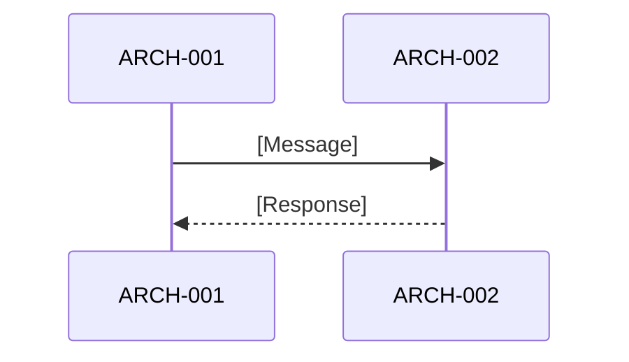

# Software Architecture Design: [FEATURE NAME]

**Feature Branch**: `[###-feature-name]`
**Created**: [DATE]
**Status**: Draft
**Source Requirements**: `specs/[###-feature-name]/v-model/requirements.md`

## Overview

[Brief description of the software architecture, its rationale, and how requirements map into architecture elements.]

## Architecture Framing

<!--
  Established in Phase -1 before any view is generated. This section records the
  architecture judgment that constrains all four views. Every later architectural
  decision must be consistent with this framing or explicitly flag a drift.
-->

### Architecture Intent

[State what this architecture pass is trying to make stable or explicit. What boundaries, tradeoffs, and constraints must future feature plans and implementation work preserve?]

### Core Tensions and Tradeoffs

| Tension | Current Tradeoff Direction | Affected Views | Consequence |
|---------|----------------------------|----------------|-------------|
| [e.g., Modularity vs Performance] | [e.g., Prioritize modularity; accept pipeline overhead] | Logical, Process, Data Flow | [e.g., Sequential dependency accepted for testability] |

### Stable Boundaries

| Boundary | Must Remain Stable Because | Forbidden Crossing | Affected Views |
|----------|----------------------------|--------------------|----------------|
| [e.g., Data transformation pipeline] | [e.g., All data processing must be auditable] | [e.g., No module may bypass the pipeline stages] | Logical, Data Flow |

### Change Axes

| Expected Change | Isolated By | Affected Views | Architecture Consequence |
|-----------------|-------------|----------------|--------------------------|
| [e.g., New input formats] | [e.g., Format adapter ARCH-NNN] | Interface | [e.g., Adapter isolates format changes from pipeline] |

### Invariants

| Invariant | Evidence Source | Risk If Violated |
|-----------|----------------|------------------|
| [e.g., Every data flow stage must be traceable to a REQ] | [e.g., REQ-NNN series from requirements.md] | [e.g., Coverage gap — untestable transformation] |

### Non-goals / Anti-patterns

| Non-goal / Anti-pattern | Why It Is Out of Scope or Harmful | Affected Views |
|-------------------------|-----------------------------------|----------------|
| [e.g., Black-box ARCH elements without interface contracts] | [e.g., Prevents Interface Fault Injection testing] | Interface |
| [e.g., Implementation details in architecture views] | [e.g., Architecture must stay at design-entity level per IEEE 1016] | All |

### Responsibility Collision Risks

<!--
  Responsibilities that agents or teams are likely to merge incorrectly.
  Explicit separation prevents architectural drift during implementation.
-->

| Risk | Why It Is Likely to Be Merged | Separation Strategy |
|------|-------------------------------|---------------------|
| [e.g., Parsing logic merged with validation logic] | [e.g., Both operate on input data] | [e.g., Separate ARCH elements with explicit interface contract] |

### Implementation Details to Exclude

<!--
  Concrete items that belong in module design or implementation, not architecture.
  This section defines the boundary between architecture and implementation.
-->

| Category | Excluded Items | Belongs In |
|----------|---------------|------------|
| [e.g., Programming constructs] | [e.g., Concrete classes, function signatures, DTO field names] | Module Design |
| [e.g., Infrastructure] | [e.g., Framework selections, database schemas, deployment manifests] | Module Design / Implementation |
| [e.g., APIs] | [e.g., REST endpoint paths, GraphQL mutation names, gRPC proto fields] | Module Design |

## ID Schema

- **Architecture Element**: `ARCH-NNN` — sequential identifier for each architecture element
- **Requirement**: `REQ-NNN` — from the input `requirements.md`
- **Traceability**: `REQ → ARCH`

## Architecture Design

### Logical View

<!--
  IEEE 1016 Decomposition (§5.1) + Dependency (§5.2) within IEEE 42010 Logical View.

  Each architecture element MUST have:
  - Unique ID: ARCH-NNN (sequential, never renumbered)
  - Name: Short descriptive element name
  - Description (Purpose): What this element does — IEEE 1016 "purpose" and "function" attributes
  - Parent Requirements (Dependencies): Comma-separated REQ-NNN list (many-to-many)
  - Type: Component | Service | Library | Utility | Adapter

  RULES:
  - Every REQ-NNN from requirements.md must appear as a parent in at least one ARCH-NNN
  - Use comma-separated REQ-NNN list for many-to-many relationships
  - Cross-cutting elements appear with [CROSS-CUTTING] — rationale in the Parent Requirements column
  - No ARCH element may have an empty Parent Requirements field (unless [CROSS-CUTTING])
  - The Description column serves as the IEEE 1016 "purpose" and "function" attributes

  LIFECYCLE TAGS (inline in Name or Description column when evolving):
  - [DEPRECATED — Superseded by ARCH-NNN]: Element replaced
  - [DEPRECATED — Withdrawn: <reason>]: Element removed entirely
  - [SUSPECT — Parent REQ-NNN {deprecated|modified}]: Parent requirement changed
  - [CROSS-CUTTING] elements are never deprecated via cascade — only by explicit decision
  - Deprecated elements stay in the table; they are never deleted
-->

| ARCH ID | Name | Description (Purpose) | Parent Requirements (Dependencies) | Type |
|---------|------|----------------------|-----------------------------------|------|
| ARCH-001 | [Element Name] | [What it does] | REQ-001, REQ-002 | Component |

#### Logical View Gaps

<!--
  Record gaps where a logical concern cannot be mapped to an ARCH element,
  or where uncertainty prevents complete logical decomposition.
  Every gap must name the affected element/capability and why it matters.
-->

| Gap | Affected Element / Capability | Why It Matters |
|-----|------------------------------|----------------|
| [e.g., No ARCH element for error recovery] | [e.g., REQ-NF-003 (reliability)] | [e.g., Interface fault injection needs fault propagation design] |

### Process View

<!--
  IEEE 42010 / Kruchten 4+1 — no IEEE 1016 counterpart.

  Document runtime interactions, concurrency model, and interaction patterns
  using Mermaid sequence diagrams.

  RULES:
  - Use Mermaid sequenceDiagram syntax — diagrams MUST be syntactically valid
  - Reference ARCH-NNN IDs as participants
  - Model interaction flows from requirements analysis (not from system-design — there is none in Path B)
  - This view directly feeds Concurrency & Race Condition Testing in integration test
-->

[Describe runtime behavior, concurrency model, and interaction patterns.]

**Concurrency Model**: [Pipeline / Event loop / Actor model / etc.]
**Synchronization Points**: [Describe synchronization, decision branches, execution order constraints]

#### Process View Gaps

<!--
  Record gaps in runtime behavior understanding.
  Every gap must name the affected runtime link or scenario and why it matters.
-->

| Gap | Affected Runtime Link / Scenario | Why It Matters |
|-----|----------------------------------|----------------|
| [e.g., Unknown concurrency boundary between ARCH-001 and ARCH-002] | [e.g., Data ingestion → transformation handoff] | [e.g., Race condition tests cannot define synchronization assertions] |

### Interface View — External Interface Contracts

<!--
  每个 ARCH-NNN 必须在此定义外部接口契约（CLI entry point + file I/O boundaries）。

  RULES:
  - No "black box" elements — every ARCH must have explicit contracts
  - 区分 synchronous / asynchronous 接口
  - Error contracts directly drive Interface Fault Injection testing
  - Input/output contracts directly drive Interface Contract Testing
  - 每个 ARCH 至少有一个 Input 和一个 Output

  For each module, document the parameters using the following format:
  - Inputs Accepted: Types, formats, ranges, required/optional
  - Outputs Produced: Types, guarantees, formats
  - Exceptions Thrown: Error codes, failure modes, recovery hints
-->

#### ARCH-001: [Element Name]

| Direction | Name | Type | Format | Constraints |
|-----------|------|------|--------|-------------|
| Input | [param] | [type] | [format] | [range/required] |
| Output | [return] | [type] | [format] | [guarantees] |
| Exception | [error] | [code] | [format] | [when thrown] |

### Interface View — Internal Interface Contracts

<!--
  内部接口：pipeline 中 element-to-element 的数据传递契约。

  RULES:
  - 每条连接必须定义 Source 和 Target
  - Direction 描述数据流向（单向 / 双向 / 回调）
  - Type / Format / Constraints 与 External 保持同等详细程度
  - 异常通过 Source ARCH 的 External Exception 契约覆盖
-->

| Source ARCH | Target ARCH | Interface Name | Direction | Type | Format | Constraints |
|-------------|-------------|----------------|-----------|------|--------|-------------|
| ARCH-001 | ARCH-002 | [interface name] | [direction] | [type] | [format] | [constraint] |

#### Interface View Gaps

<!--
  Record gaps in interface contracts between ARCH elements.
  Every gap must name the affected interface/contract and why it matters.
-->

| Gap | Affected Interface / Contract | Why It Matters |
|-----|-------------------------------|----------------|
| [e.g., Undefined error protocol for ARCH-003 → ARCH-004] | [e.g., Internal data handoff] | [e.g., Interface fault injection cannot model failure propagation] |

### Data Flow View

<!--
  IEEE 1016 Data Design (§5.4) + IEEE 42010 pipeline semantics.

  Trace data through architecture stages with intermediate formats.

  RULES:
  - Show intermediate data formats at each pipeline stage
  - Document data protection measures (at rest, in transit) where applicable
  - Each flow traces input → transformation → output with intermediate formats
  - Data flows directly drive Data Flow Testing in integration test
-->

| Stage | Module | Input Format | Transformation | Output Format |
|-------|--------|-------------|----------------|---------------|
| [Stage] | ARCH-001 | [Format] | [Transformation] | [Format] |

**Data Design supplement** (per IEEE 1016 §5.4):

| Data Entity | Owning ARCH | Storage | Protection | Lifecycle |
|-------------|-------------|---------|------------|-----------|

#### Data Flow View Gaps

<!--
  Record gaps in data flow understanding.
  Every gap must name the affected data flow/entity and why it matters.
-->

| Gap | Affected Data Flow / Entity | Why It Matters |
|-----|-----------------------------|----------------|
| [e.g., Unknown intermediate format between Stage 2 and Stage 3] | [e.g., Transformation chain for REQ-005 data] | [e.g., Data flow tests cannot validate intermediate integrity] |

## Architecture Gates

<!--
  Self-check performed during generation (Step 9). Each gate is a hard ERROR if failed.
  The generated artifact must pass all gates before being considered complete.
-->

| Gate | Condition | Status | Evidence |
|------|-----------|--------|----------|
| No implementation leakage | No view contains concrete classes, file paths, functions, DTO fields, database tables, framework selections, or deployment manifests. Architecture-level type descriptions (String, Array, Dict) are permitted. | ✅ / ❌ | [Brief verification note] |
| Boundary completeness | Every stable boundary has an explicit forbidden crossing documented in Architecture Framing | ✅ / ❌ | [Brief verification note] |
| Decision traceability | Every major architectural decision is tied to a REQ, quality characteristic, or explicit tradeoff with affected view | ✅ / ❌ | [Brief verification note] |
| Invariant grounding | Every invariant is tied to a requirement, scenario, or boundary constraint from requirements.md | ✅ / ❌ | [Brief verification note] |
| No invented capabilities | All ARCH elements trace to REQ-NNN or are flagged as [DERIVED] / [CROSS-CUTTING] with explicit rationale | ✅ / ❌ | [Brief verification note] |
| Gap explicitness | All uncertain areas recorded as specific gaps with affected view and consequence; no generic "TBD" without scope | ✅ / ❌ | [Brief verification note] |

## Traceability Summary

| Metric | Count |
|--------|-------|
| Total Requirements | [N] |
| Total Architecture Elements | [N] |
| Forward Coverage (REQ → ARCH) | [N/%] |

### REQ → ARCH Mapping

| Requirement | Architecture Elements |
|-------------|----------------------|
| REQ-001 | ARCH-001 |

## Derived Requirements and Modules

[List any derived items flagged during generation, or `None` if all items trace to requirements.]

## Glossary

| Term | Definition |
|------|------------|
| [Term] | [Definition] |
